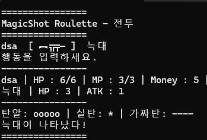

<!-- HERO (centered only at the top) -->
<h1 align="center">MagicShot Roulette</h1>

<em>러시안룰렛 규칙을 턴제 RPG 전투로 변형한 콘솔 게임</em>

  

---

## About the Game

**MagicShot Roulette**는 벅샷룰렛의 탄 분기 규칙을 턴제 RPG 전투 구조에 적용한 콘솔 게임입니다. 플레이어는 현재 약실의 탄 상태와 총구 방향에 따라 행동 결과가 달라지는 전투를 진행하며, 아이템과 보상을 통해 전투 상태를 관리합니다. 현재 버전은 1층과 2층까지 플레이할 수 있습니다.

## Features

- **탄 분기 시스템**: 실탄 / 가탄과 대상에 따른 결과 처리
- **턴제 전투 루프**: 플레이어 행동, 결과 판정, 몬스터 턴 처리
- **아이템 시스템**: 탄 확인, 탄 제거, 피해 증가, 방어, 탄 반전 기능
- **성장 요소**: HP, MP, 인벤토리 슬롯 강화
- **콘솔 입력 처리**: 방향키와 Space 기반 조작

## Controls

- **↑ / ↓** : 선택지 이동
- **← / →** : 총구 방향 변경
- **Space** : 선택 / 진행
- **Esc** : 게임 종료

## Development Notes

제한된 콘솔 환경에서 전투 상태, 입력, 턴 진행, 아이템 효과를 하나의 게임 루프로 구성하는 데 초점을 두었습니다.  
구현 범위 조정을 위해 몬스터의 총기 사용은 제외하고, 플레이어의 탄 선택과 아이템 활용을 중심으로 전투 구조를 단순화했습니다.

## Current Version

- 1층 / 2층 플레이 가능
- 플레이어 총기 사용
- 몬스터 공격 턴
- 아이템 사용
- 승리 보상 및 맵 이벤트
